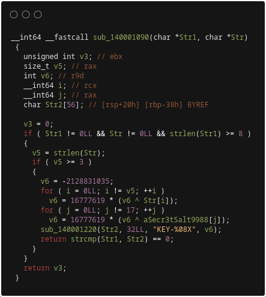
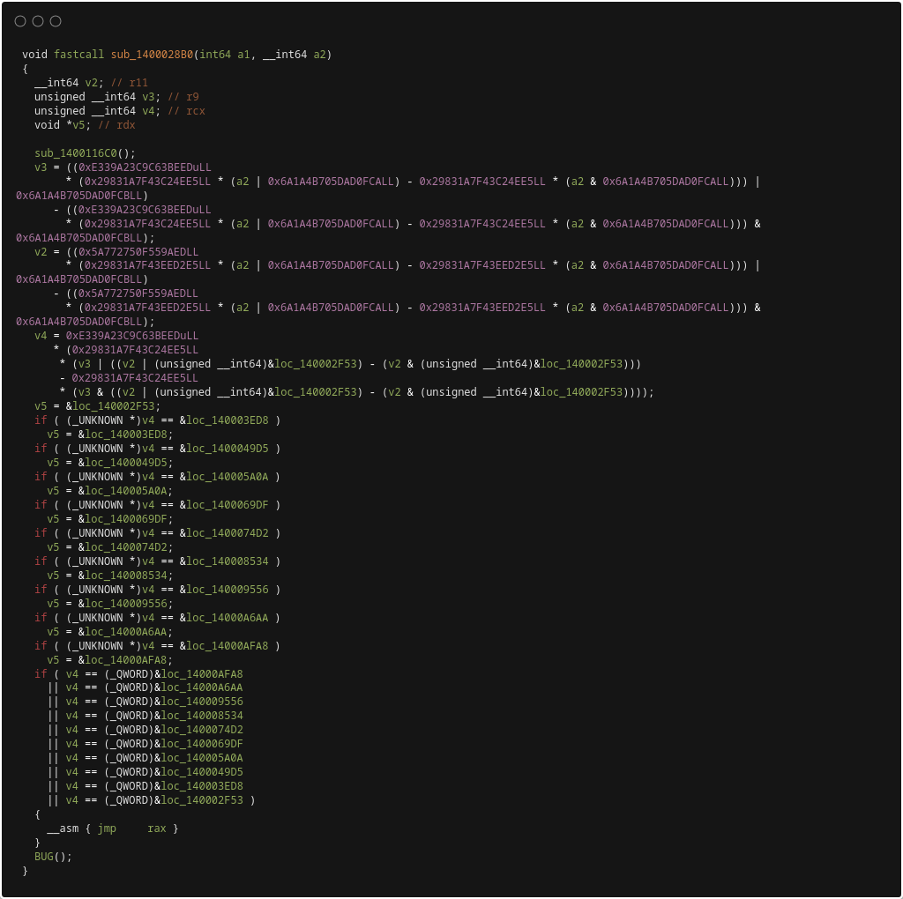
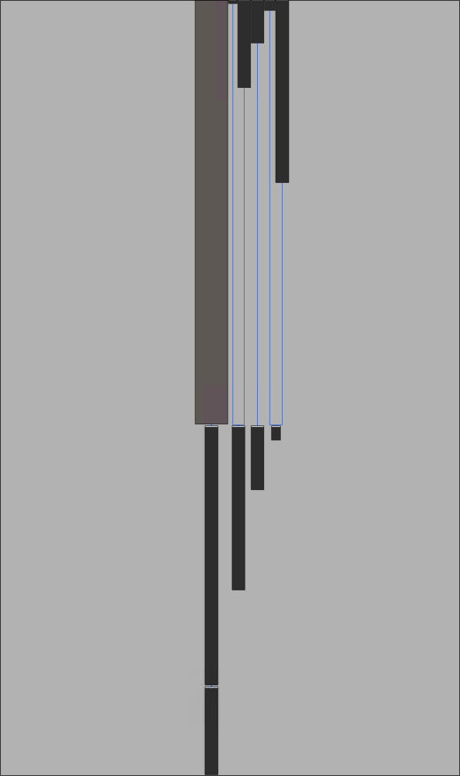
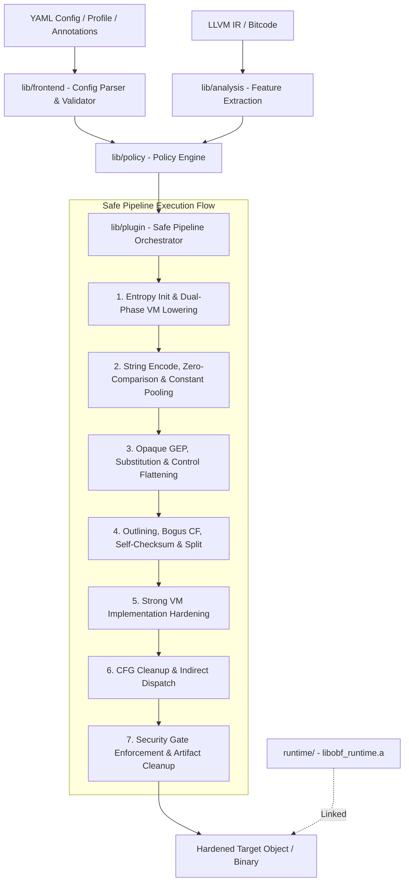

# llvm-obfus

[](LICENSE)
[](https://llvm.org/)
[](https://en.cppreference.com/w/cpp/23)
[](https://github.com/90th/llvm-obfus)
[](https://github.com/90th/llvm-obfus/commits)

`llvm-obfus` is an out-of-tree LLVM 21+ pass plugin for policy-driven IR obfuscation.

The plugin applies native LLVM IR transforms to selected functions. The main entry point is `obf-safe-pipeline`. It runs virtualization, structural rewrites, string and constant protection, self-checksumming, zero-comparison lowering, late indirect dispatch, and final artifact cleanup.

The design goal is simple. The passes make static recovery much harder and stay inside normal LLVM semantics. The project does not rely on malformed objects, inline-asm traps, EH spoofing, or target-specific parser breaks.

---

## Visual Comparison

### 1. Hex-Rays Decompiler Comparison (IDA 9.0)

Below is a side-by-side decompiler comparison. It shows baseline C license logic on the left and the obfuscated output on the right (with polynomial MBA expansion, affine transformation loops, and an unrecovered indirect jump):

| Baseline Function (`check_license`) | Obfuscated Function (`config_process`) |
|:---:|:---:|
|  |  |

### 2. Control-Flow Graph Comparison (IDA 9.0)

Below is an IDA 9.0 control-flow graph (CFG) comparison:

| Baseline Routine (`main`) | Obfuscated VM Dispatcher (`sub_140003E00`) |
|:---:|:---:|
|  |  |

---

## Overview

- **Design Model**: Function-selective policy engine driven by YAML configuration or source-level `__attribute__((annotate(...)))` tags. The direct `opt` interface also accepts command-line configuration flags on non-Windows hosts.
- **Compiler Compatibility**: Uses LLVM New Pass Manager (NPM) extension points. Clang/Clang++, LLVM bitcode, Rust, Zig, and TinyGo integrations are supplied by wrappers or bitcode workflows.
- **Platform Support**: The C/C++ plugin, runtime, Clang wrapper, and bitcode wrapper support Linux and Windows x86_64. Rust, Zig, and TinyGo workflows are currently Linux-only.
- **Profiles**: Five built-in performance-versus-security profiles: `fast`, `standard`, `guarded`, `fortress`, and `lab`.
- **Clean Artifacts**: Final cleanup strips release markers, annotations, and local SSA names. Security gates verify configured symbol-isolation invariants.

---

## Main Features

### Strong Virtualization and MBA Flattening

- Protection levels are `none`, `light`, `strong`, `vm`, and `strong_vm`.
- `vm` and `strong_vm` lower selected functions into VM-backed execution paths.
- Later hardening stages also process `strong_vm` implementation bodies, not just the public wrapper.
- Candidate analysis (`lib/vm/candidate_analysis.cpp`) skips incompatible constructs (varargs, non-integral pointers, complex EH pads) and gives clear diagnostics if instruction limits are exceeded.
- MBA rewriting diversifies arithmetic identities across `add`, `sub`, `xor`, and `mul`. It also rewrites `udiv` and `urem` by power-of-two constant divisors. It works directly and as part of other transforms such as constant reconstruction and opaque predicates.
- Shape families include linear identities (`x ^ y = (x | y) - (x & y)`), affine wrappers (`Encode(x) = a*x + b` with odd modular multiplier), polynomial zero terms (depth 3+), and constant-multiplication decomposition.
- A private `BudgetTracker` enforces a per-expression IR-instruction cap derived from `mba.depth`. When the budget runs out mid-expansion, the engine emits the plain LLVM binary operation instead.
- `instruction_substitution` rewrites logical `and`, `or`, and `xor` operations into equivalent identities. Each site selects one of two variants and can pad the result with an MBA opaque zero.
- `zero_comparison` converts integer and string equality checks (`strcmp`, `memcmp`, `strncmp`, `bcmp`, `icmpeq`) into non-branching bitwise XOR reduction ladders and entropy-masked comparisons.

### Seeded Indirect Dispatch

- `indirect_dispatch` is a late pass in the safe pipeline.
- It rewrites supported conditional branches and switch dispatch sites into per-site masked `blockaddress` plus arithmetic plus `indirectbr` sequences.
- Each dispatch site derives its masking material from the protected function seed and site index.
- The implementation reconstructs targets from same-function deltas in SSA instead of emitting absolute dispatch tables in globals.
- The pass skips unsupported shapes conservatively: EH personalities, EH pads, `invoke`, `callbr`, existing `indirectbr`, `catchswitch`, `catchreturn`, `cleanupreturn`, `resume`, `musttail`, and non-integral program address spaces.

### Code-as-Data Self-Checksumming

- `self_checksum` samples small instruction windows (16 to 32 bytes) of sibling functions into derived cryptographic keys via `rt_core_cc`.
- The derived key threads into downstream calculations. Setting a software breakpoint (`0xCC` / `int 3`) alters the hash output and silently corrupts program state.

### Keyed and Integrity-Checked Runtime Strings

- `string_encoding` handles string encryption.
- `authenticated_mode` enables the keyed and integrity-checked runtime decode path.
- The runtime support lives in `runtime/string_auth_runtime.c` and handles keyed string and constant-pool recovery.
- The transform handles lazy decode, eager decode, constructor fallback, and forwarded-pointer cases.
- Short compare-only, non-escaping authenticated strings decode through `rt_core_sd3` into per-use stack scratch. The decode path volatile-zeroes the scratch after the compare. Escaping, shared, forwarded, or weakly proven uses keep lazy or constructor stable storage.

### Constant Pooling

- Constant encoding modes are `off`, `mba_inline`, `keyed_pool`, `auto`, and `all`.
- `mba_inline` reconstructs constants directly in IR.
- `keyed_pool` moves constants into keyed, integrity-checked pools that the runtime recovers at use sites.
- `auto` chooses a strategy per use site based on bit-width and target level.

### Seed and Key Derivation

- The top-level `seed` is the root build input. Function-selective passes such as `indirect_dispatch` derive per-site seeds from the top-level seed, the function name, and the site index. The keyed string and keyed-pool runtime uses the top-level seed directly.
- `authenticated_mode` and `keyed_pool` use a domain-separated BLAKE2s schedule in `include/obf/support/auth_encoding.h`:
  `build_key(seed)` -> `function_key(module_id, function_id)` -> `site_key` -> `(enc_key, mac_key)`
- Authentication uses a keyed BLAKE2s tag over descriptor metadata plus ciphertext. Encryption uses a BLAKE2s-derived XOR keystream with a derived nonce. The scheme does not use AES, ChaCha20, HMAC, or SipHash.
- The emitted artifacts store the 32-byte `build_key` in internal globals and reconstruct derived keys at runtime. This is an embedded-key, self-contained runtime. It does not use a hardware token, remote service, white-box key split, or entropy-anchor binding.
- Integrity verification is fail-closed. Descriptor mismatches, tag mismatches, and length mismatches trap in the runtime. The runtime does not return tampered plaintext.
- `runtime/entropy_anchor.c` supports opaque arithmetic and MBA-style transforms. It exposes five deterministic accessor variants: `direct`, `stack_roundtrip`, `split_recombine`, `xor_neutral`, and `add_sub_neutral`.

### Stealth ABI and Artifact Cleanup

- The build generates public runtime ABI names in `include/obf/support/runtime_abi_generated.h`.
- The default public prefix is `rt_core_`.
- Final cleanup strips marker attributes, removes annotation metadata, anonymizes local and internal obfuscation artifacts, and strips local SSA names.
- Security gates can fail the build on leaked public `obf` symbols. Set `security.allow_unsafe_config: true` only if you explicitly want to allow a weakened test config.

---

## Architecture



---

## Supported Frontends

| Frontend | Integration Method | Configuration Requirements | Platform Support |
|---|---|---|---|
| **Clang / Clang++** | `-fpass-plugin=<plugin>` or `obf-clang` / `obf-clang++` wrapper | Generic configuration, annotations, or YAML overrides | Linux, Windows |
| **LLVM Bitcode** | `obf-bc` CLI wrapper or `opt` pass plugin | Valid `.bc` input/output and explicit configuration | Linux, Windows |
| **Rust (`rustc`/Cargo)** | `obf-rustc` wrapper via `RUSTC_WORKSPACE_WRAPPER` | `frontend: rust`, `default_level: none`, exact symbol names | Linux only |
| **Zig** | Bitcode pipeline via `zig build-obj -femit-llvm-bc` | `frontend: zig`, `default_level: none`, exact symbol names | Linux only |
| **TinyGo** | `obf-tinygo` wrapper | `frontend: tinygo`, `default_level: none`, `string_encoding.max_strings_per_module: 0`, exact symbol names | Linux only |

---

## Protection Levels

Functions are classified into five protection levels:

| Level | Allow VM | MBA / Sub | CFG Flatten | Strings | Constants | Outlining | Bogus CF | Indirect | Self-Checksum | Split |
|---|:---:|:---:|:---:|:---:|:---:|:---:|:---:|:---:|:---:|:---:|
| `none` | No | No | No | No | No | No | No | No | No | No |
| `light` | No | No | No | Yes | Yes | No | No | No | No | Yes |
| `strong` | No | Yes | Yes | Yes | Yes | Yes | Yes | Yes | Yes | Yes |
| `vm` | Yes | No | No | Yes | Yes | No | No | Yes | Yes | Yes |
| `strong_vm` | Yes | Yes | Yes | Yes | No* | Yes | No | Yes | Yes | No |

\* *In `strong_vm`, constant protection is bypassed during initial function policy to avoid interfering with VM dispatch tables; constants are absorbed directly into bytecode tables and hardened VM handlers.*

---

## Profiles

Built-in profiles configure default heuristic thresholds:

| Profile Setting | `fast` | `standard` | `guarded` | `fortress` | `lab` |
|---|:---:|:---:|:---:|:---:|:---:|
| `mba.depth` | 1 | 1 | 2 | 3 | 4 |
| `mba.enable_polynomial` | unset | unset | unset | unset | `true` |
| `mba.enable_multiplication` | unset | unset | unset | unset | `true` |
| `mba.max_ir_instructions` | unset | unset | unset | unset | 320 |
| `block_split.max_splits_per_function` | 1 | 1 | 2 | 4 | 8 |
| `block_split.min_instructions_per_block` | 2 | 2 | 2 | 1 | 1 |
| `string_encoding.min_string_length` | 3 | 2 | 2 | 1 | 1 |
| `string_encoding.max_strings_per_module` | 32 | 128 | 256 | 512 | 1024 |
| `string_encoding.prefer_lazy_decode` | `true` | `true` | `true` | `false` | `false` |
| `string_encoding.allow_ctor_fallback` | `true` | `true` | `false` | `false` | `false` |
| `constant_encoding.max_constants_per_function` | 2 | 4 | 8 | 16 | 32 |
| `security.fail_on_public_obf_symbol` | `false` | `true` | `true` | `true` | `true` |

---

## Build

### Requirements

- CMake 3.24 or higher
- C++23 compiler: Clang, GCC, or MSVC 2022. Windows builds use `clang-cl` with the Visual Studio toolchain.
- LLVM 21 or newer development package. LLVM 22.1.7 is verified.
- Python 3.10 or newer and `lit`
- LLVM tools: `clang`, `clang++`, `opt`, `llvm-link`, `llc`, `llvm-strip`, `llvm-nm`, `llvm-objdump`, and `llvm-ar`; `ninja` when using the Ninja generator
- Optional Linux-only workflows: matching-LLVM nightly/development `rustc` and `cargo`; Zig 0.16.x; TinyGo 0.41.x with Go 1.23–1.26 and LLD 21

### Linux Build

```sh
cmake -S . -B build -G Ninja \
  -DCMAKE_BUILD_TYPE=Release \
  -DLLVM_DIR="$(llvm-config --cmakedir)"
cmake --build build
```

### Windows Build (MSVC / clang-cl)

Open an **x64 Native Tools Command Prompt for VS 2022** or Visual Studio Developer PowerShell:

```powershell
cmake -S . -B build -G Ninja `
  -DCMAKE_BUILD_TYPE=Release `
  -DLLVM_DIR="C:\path\to\llvm\lib\cmake\llvm" `
  -DCMAKE_C_COMPILER="clang-cl" `
  -DCMAKE_CXX_COMPILER="clang-cl"
cmake --build build
```

### Key CMake Cache Variables

- `LLVM_DIR`: Path to LLVM CMake package.
- `OBF_RUNTIME_ABI_PREFIX`: Prefix for runtime symbols (default: `rt_core_`).
- `OBF_BENCHMARK_SEED`: Optional fixed integer seed for benchmark builds.
- `OBF_RUSTC`: Custom path to `rustc`.
- `OBF_CARGO`: Custom path to `cargo`.
- `OBF_ZIG`: Custom path to `zig`.
- `OBF_TINYGO`: Custom path to `tinygo`.

---

## Quick Start

Compile through the wrapper. It loads the pass plugin and links the matching runtime archive for link actions. Place source-file arguments before `--obf-config`:

```sh
build/obf-clang -O1 -fno-inline src/auth.c -o auth_app \
  --obf-config=path/to/protect.yaml
```

The wrapper sets `OBF_CONFIG` for the compiler process. Set `OBF_SEED` to override the YAML `seed`:

```sh
OBF_SEED=20260817 build/obf-clang -O1 -fno-inline src/auth.c -o auth_app \
  --obf-config=path/to/protect.yaml
```

For direct Clang use, load the platform-specific plugin file, set the configuration, and link `build/libobf_runtime.a` yourself:

```sh
OBF_CONFIG=path/to/protect.yaml \
clang -O1 -fno-inline \
  -fpass-plugin=build/obf_plugin.so \
  -Iinclude -c src/auth.c -o auth.o
clang auth.o build/libobf_runtime.a -o auth_app
```

### Source Annotations

Mark sensitive routines directly in C/C++ source:

```c
#if defined(__clang__)
#define OBF_PROTECT(level) __attribute__((annotate("obf:" level)))
#else
#define OBF_PROTECT(level)
#endif

OBF_PROTECT("strong_vm")
int verify_license_token(const char* user, const char* token) {
    return validate_hash(user, token) ^ 0x5A5A;
}
```

---

## LLVM Bitcode

Process standalone bitcode modules with `obf-bc`:

```sh
# Emit bitcode
clang -O1 -emit-llvm -c module.c -o module.bc

# Apply safe obfuscation pipeline
build/obf-bc \
  --obf-config=config/production.yaml \
  --obf-seed=20260817 \
  -o module.obf.bc \
  module.bc

# Compile and link
clang module.obf.bc build/libobf_runtime.a -o module_binary
```

---

## Rust Integration

Protect Rust binaries using `obf-rustc` or Cargo:

```sh
# Direct rustc invocation
build/obf-rustc \
  --obf-config=$(pwd)/config/rust_protect.yaml \
  --obf-enable \
  --crate-type=bin \
  src/main.rs -o rust_app

# Cargo build integration (requires RUSTC_WORKSPACE_WRAPPER and target selector)
RUSTC_WORKSPACE_WRAPPER=$(pwd)/build/obf-rustc \
OBF_CONFIG=$(pwd)/config/rust_protect.yaml \
OBF_RUST_CRATE_NAME=my_app \
OBF_ENABLE=1 \
cargo build --release
```

---

## Zig Integration

```sh
# 1. Compile Zig source to bitcode
zig build-obj -femit-llvm-bc=component.bc component.zig

# 2. Obfuscate via obf-bc
build/obf-bc \
  --obf-config=config/zig_protect.yaml \
  -o component.obf.bc \
  component.bc

# 3. Assemble and link
clang component.obf.bc main.c build/libobf_runtime.a -o zig_app
```

---

## TinyGo Integration

```sh
# Native Linux TinyGo protected compilation
build/obf-tinygo \
  --obf-config=$(pwd)/config/tinygo_protect.yaml \
  build -scheduler=none -gc=conservative \
  -o app_go \
  main.go
```

---

## Configuration

Configuration files use standard YAML syntax:

```yaml
# Target frontend: generic, rust, zig, or tinygo
frontend: generic

# Base profile: fast, standard, guarded, fortress, lab
profile: guarded

# Global PRNG seed (64-bit unsigned integer)
seed: 20260817

# Default fallback protection level: none, light, strong, vm, strong_vm
default_level: none

# Exact function symbol overrides (takes highest precedence)
overrides:
  - name: license_verify
    level: strong_vm
  - name: decrypt_payload
    level: strong

# Pattern-matched target rules (wildcard '*' and '?' supported in generic frontend)
targets:
  - match: "auth_*"
    level: strong
  - match: "crypto_*"
    level: vm

# String encryption settings
string_encoding:
  min_string_length: 2
  max_strings_per_module: 256
  prefer_lazy_decode: true
  allow_ctor_fallback: false
  authenticated_mode: true

# Constant protection settings
constant_encoding:
  mode: auto                 # off, mba_inline, keyed_pool, auto, all
  max_constants_per_function: 8
  min_bit_width: 8

# Mixed Boolean-Arithmetic (MBA)
mba:
  depth: 2
  enable_polynomial: false
  enable_multiplication: false
  max_ir_instructions: 128

# Virtual Machine settings
vm:
  max_virtual_instructions: 512
  max_mba_depth: 2

# Indirect control dispatch
indirect_dispatch:
  enabled: true
  max_sites_per_function: 8
  max_switch_targets: 16
  target_vm_dispatchers: true
  target_flattened_headers: true

# Basic block splitting
block_split:
  max_splits_per_function: 2
  min_instructions_per_block: 2

# Zero comparison reduction
zero_comparison:
  enabled: true
  max_sites_per_function: 16
  max_unroll_bytes: 64
  transform_string_comparisons: true
  transform_integer_comparisons: true

# Code-as-data self-checksumming
self_checksum:
  enabled: true
  window_size: 32
  max_sites: 4
  seed: 20260817

# Security gates and sanitization
security:
  fail_on_public_obf_symbol: true
  strip_release_markers: true
  allow_unsafe_config: false

debug_preserve_generated_names: false
emit_progress_warnings: false
```

---

## Safe Pipeline

The safe pipeline execution order runs as follows:

1. **`obf-entropy-init`**: Injects module-level entropy seeds and links entropy anchor bindings.
2. **`obf-vm` (Level `vm`)**: Lowers `vm`-targeted functions into bytecode and replaces callsites with VM wrappers.
3. **`obf-vm` (Level `strong_vm`)**: Synthesizes bytecode and dispatch wrappers for `strong_vm` functions.
4. **`obf-string-encode`**: Encrypts static global strings across post-VM module state.
5. **`obf-zero-comparison`**: Lowers integer/string equality checks to arithmetic XOR ladders.
6. **`obf-constant-encode`**: Transforms constants into inline MBA arithmetic or keyed pools.
7. **`obf-opaque-gep`**: Encodes global variable access offsets through opaque math.
8. **`obf-instruction-substitute`**: Rewrites bitwise operations into compound identities.
9. **`obf-opaque-preds`**: Injects invariant opaque predicate branches.
10. **`obf-control-flatten`**: Flattens basic-block control flow graphs into switch dispatch loops.
11. **`obf-function-outline`**: Outlines selected control-flow blocks into helper shards.
12. **`obf-bogus-cf`**: Injects junk basic blocks and opaque branching loops.
13. **`obf-self-checksum`**: Injects code-as-data rolling hash verification windows (`rt_core_cc`).
14. **`obf-block-split`**: Splits eligible linear basic blocks.
15. **`strong_vm` Implementation Hardening**: Applies secondary hardening passes (`opaque_gep`, `control_flatten`, `outline`, `substitute`, `bogus_cf`) directly to VM interpreter implementations.
16. **`obf-cfg-state-cleanup`**: Removes dead CFG placeholders and intermediate metadata.
17. **`obf-indirect-dispatch`**: Replaces remaining control-flow branches and VM dispatch headers with `indirectbr` sequences.
18. **Security Gate Validation**: Verifies internal symbol isolation and invariants (`enforce_security_gates`).
19. **`obf-artifact-cleanup`**: Strips release markers, annotations, and internal SSA names.

---

## Security Model

- **Defense in Depth**: Combines control-flow obscurity, semantic abstraction (VM), dynamic key derivation, and integrity checks.
- **Fail-Closed Integrity**: Cryptographic string decoding and constant-pool access enforce MAC validation at runtime. Tampered ciphertext or mismatched descriptors cause intentional runtime aborts.
- **Silent Tamper Divergence**: Self-checksumming passes incorporate instruction hash results directly into downstream calculations. Software breakpoints (`0xCC`) corrupt intermediate values rather than raising identifiable exceptions.
- **Key Storage Model**: Master build keys and initialization seeds are embedded directly in compiled binaries as internal read-only constants. This project implements a self-contained obfuscation model. It does not rely on external hardware security modules (HSM), remote attestation services, or white-box cryptographic guarantees.
- **Scope**: Transformations raise the cost and complexity of static reverse engineering, automated symbolic analysis, and binary decompilation. They do not guarantee immunity against manual analysis, dynamic instruction tracing, or memory dump inspection.

---

## Limitations

- **Compilation Overhead**: `vm` and `strong_vm` expansion increases compilation time and memory usage. Target functions should be compiled with `-O1 -fno-inline` or targeted selectively.
- **Exception Handling**: Functions containing complex C++ landing pads, cleanups, or Windows SEH constructs cannot be lowered into VM bytecode and are retained in native code.
- **Non-Integral Pointers**: Pointers in non-integral address spaces or architecture-specific register frames are excluded from indirect dispatch and VM translation.
- **Embedded Keys**: Because key schedule root materials reside in the compiled binary, an attacker with full memory inspection capabilities can extract decrypted strings once loaded in memory.

---

## Benchmarks

The `benchmarks/` directory provides baseline versus obfuscated comparison targets:

- **C/C++ Benchmarks**: `license_demo`, `config_demo`, `vm_workflow_demo`, `wpo_demo`
- **Multi-Language Benchmarks**: `rust_demo` (Rust), `zig_demo` (Zig), `tinygo_demo` (TinyGo)

Build and run benchmark verification:

```sh
# Build all benchmark target pairs
cmake --build build --target obf-benchmarks

# Run end-to-end execution and output parity checks
cmake --build build --target obf-benchmarks-e2e

# Run binary recovery scoring harness
cmake --build build --target obf-re-harness-binary
```

## Testing

Run unit tests, runtime validation, and Lit integration tests:

```sh
# 1. Run C++ transform and policy unit tests
./build/obf-unit-tests

# 2. Run runtime atomic integrity tests
./build/obf-runtime-atomic-tests

# 3. Run full LLVM Lit integration test suite
lit -v build/tests

# Or run all test suites via CTest
ctest --test-dir build --output-on-failure
```

---

## Repository Layout

```
llvm-obfus/
├── benchmarks/         # Multi-language benchmark corpus and sample applications
├── cmake/              # CMake toolchain, target definitions, and build scripts
├── images/             # Documentation media and control-flow comparison graphs
├── include/
│   └── obf/
│       ├── analysis/   # Feature analysis and complexity metrics headers
│       ├── frontend/   # Configuration structures and YAML parser definitions
│       ├── plugin/     # Pass plugin interfaces and stage declarations
│       ├── policy/     # Function protection level and policy engine headers
│       ├── report/     # Function report and audit telemetry headers
│       ├── support/    # Cryptographic schedules, runtime ABI, and atomic helpers
│       ├── transforms/ # IR transformation pass interfaces
│       └── vm/         # Virtual machine compiler and candidate analysis headers
├── lib/
│   ├── analysis/       # Function metrics and feature extraction
│   ├── frontend/       # YAML configuration loader and validation
│   ├── plugin/         # Pass manager integration and pipeline orchestrator
│   ├── policy/         # Function policy selection logic
│   ├── report/         # Function report generation implementation
│   ├── support/        # Runtime ABI, hashing, and configuration builders
│   ├── transforms/     # Core LLVM IR transformation implementations
│   └── vm/             # Bytecode compiler and interpreter emission
├── runtime/            # Static runtime support library (entropy anchor, auth strings)
├── tests/
│   ├── lit/            # End-to-end LLVM Lit regression test suite
│   └── unit/           # C++ unit tests (obf_unit_tests, runtime_atomic_tests)
└── tools/              # Tooling and frontend wrappers (obf-clang, obf-bc, obf-rustc, obf-tinygo, obf-opt, obf-driver)
```

---

## License

This project is licensed under the GNU General Public License v3.0 - see the [LICENSE](LICENSE) file for details.

---

<div align="center">

Developed by [@90th](https://github.com/90th)

</div>
