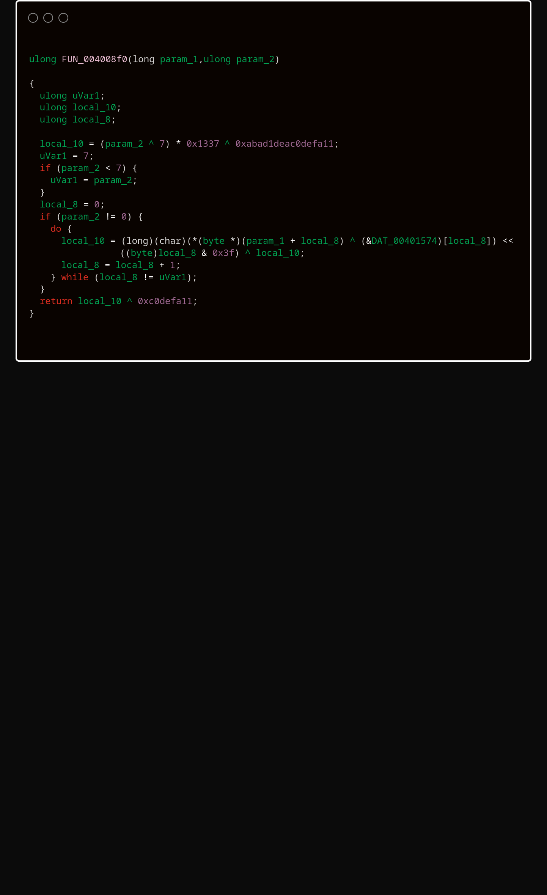
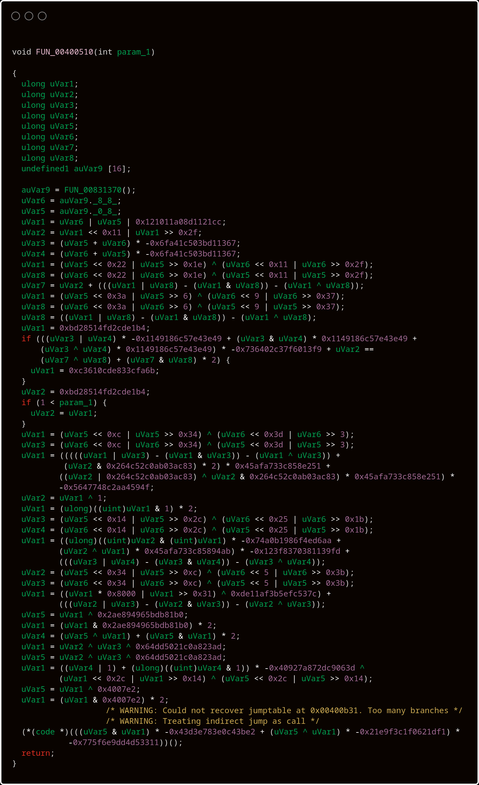

# llvm-obfus
[](LICENSE)
[](https://llvm.org/)
[](https://en.cppreference.com/w/cpp/23)
[](https://github.com/90th/llvm-obfus)
[](https://github.com/90th/llvm-obfus/commits)

`llvm-obfus` is an out-of-tree LLVM 21+ pass plugin for policy-driven IR obfuscation.

The project applies native LLVM IR transforms to selected functions. The main production entry point is `obf-safe-pipeline`, which composes virtualization, structural rewrites, string and constant protection, late indirect dispatch, and final artifact cleanup.

The design goal is simple. The passes make static recovery much harder and stay inside normal LLVM semantics. The project does not rely on malformed objects, inline-asm traps, EH spoofing, or target-specific parser breaks.

## Main Features

### Strong Virtualization And MBA Flattening

- Protection levels are `none`, `light`, `strong`, `vm`, and `strong_vm`.
- `vm` and `strong_vm` lower selected functions into VM-backed execution paths.
- Later hardening stages also process `strong_vm` implementation bodies, not just the public wrapper.
- MBA rewriting diversifies arithmetic identities across `add`, `sub`, `xor`, and `mul`. It also rewrites `udiv` and `urem` by power-of-two constant divisors. It works directly and as part of other transforms such as constant reconstruction and opaque predicates.
- Shape families include linear identities (`x ^ y = (x | y) - (x & y)`), affine wrappers (`Encode(x) = a*x + b` with odd modular multiplier), polynomial zero terms (depth 3+), and constant-multiplication decomposition.
- Entropy thunk interfaces use one of two forms per function: aggregate pair or out-parameter. First-hop entropy mixing uses per-site `xor`, `mul_add`, `rotate_xor`, or `bit_split` selection before MBA shape builders run.
- A private `BudgetTracker` enforces a per-expression IR-instruction cap derived from `mba.depth`. When the budget is exhausted mid-expansion, the engine emits the plain LLVM binary operation instead.
- `instruction_substitution` rewrites logical `and`, `or`, and `xor` operations into equivalent identities, such as `x & y = (x | y) - (x ^ y)`. Each site selects one of two variants and can pad the result with an MBA opaque zero.

### Seeded Indirect Dispatch

- `indirect_dispatch` is a late pass in the safe pipeline.
- It rewrites supported conditional branches and switch dispatch sites into per-site masked `blockaddress` plus arithmetic plus `indirectbr` sequences.
- Each dispatch site derives its masking material from the protected function seed and site index.
- The implementation reconstructs targets from same-function deltas in SSA instead of emitting absolute dispatch tables in globals.
- This pass does not use the authenticated BLAKE2s runtime that strings and constant pools use.
- The pass skips unsupported shapes conservatively: EH personalities, EH pads, `invoke`, `callbr`, existing `indirectbr`, `catchswitch`, `catchreturn`, `cleanupreturn`, `resume`, `musttail`, and non-integral program address spaces.

### Keyed And Integrity-Checked Runtime Strings

- The `string_encoding` section configures string encoding.
- `authenticated_mode` enables the keyed and integrity-checked runtime decode path.
- The runtime support lives in `runtime/string_auth_runtime.c` and handles keyed string and constant-pool recovery.
- The transform handles lazy decode, eager decode, constructor fallback, and forwarded-pointer cases.
- Short compare-only, non-escaping authenticated strings decode through `rt_core_sd3` into per-use stack scratch. The decode path volatile-zeroes the scratch after the compare. Escaping, shared, forwarded, or weakly proven uses keep lazy or constructor stable storage.

### Constant Pooling

- Constant encoding modes are `off`, `mba_inline`, `keyed_pool`, `auto`, and `all`.
- `mba_inline` reconstructs constants directly in IR.
- `keyed_pool` moves constants into keyed, integrity-checked pools that the runtime recovers at use sites.
- `auto` chooses a strategy per use site.

### Seed And Key Derivation

- The top-level `seed` is the root build input. Function-selective passes such as `indirect_dispatch` derive per-site seeds from the top-level seed, the function name, and the site index. The keyed string and keyed-pool runtime currently uses the top-level seed directly.
- `authenticated_mode` and `keyed_pool` use a domain-separated BLAKE2s schedule. The file `include/obf/support/auth_encoding.h` implements this schedule.
- The schedule is `build_key(seed)` -> `function_key(module_id, function_id)` -> per-site or per-pool key -> labeled `enc` and `mac` subkeys.
- Authenticated strings derive distinct keys from descriptor metadata including `module_id`, a derived `function_id`, and `site_id`. Keyed constant pools derive distinct keys from `module_id` and `pool_id`.
- Authentication uses a keyed BLAKE2s tag over descriptor metadata plus ciphertext. Encryption uses a BLAKE2s-derived XOR keystream with a derived nonce. The scheme does not use AES, ChaCha20, HMAC, or SipHash.
- The emitted artifacts store the 32-byte `build_key` in internal globals and reconstruct derived keys at runtime from descriptor metadata. This is an embedded-key, self-contained runtime. It does not use a hardware token, remote service, white-box key split, or entropy-anchor binding.
- Integrity verification is fail-closed. Descriptor mismatches, tag mismatches, and length mismatches trap in the runtime. The runtime does not return tampered plaintext.
- `runtime/entropy_anchor.c` supports opaque arithmetic and MBA-style transforms. It is separate from the keyed string and constant-pool key schedule. It exposes five deterministic accessor variants: `direct`, `stack_roundtrip`, `split_recombine`, `xor_neutral`, and `add_sub_neutral`. The function and salt determine the variant.

### Stealth ABI And Artifact Cleanup

- The build generates public runtime ABI names in `build/include/obf/support/runtime_abi_generated.h`.
- The default public prefix is `rt_core_`.
- Final cleanup strips marker attributes, removes annotation metadata, anonymizes local and internal obfuscation artifacts, and strips local SSA names.
- Security gates can fail the build on leaked public `obf` symbols. **Note:** The plugin config preflight fails the build on weakened security configs. To allow a weakened config, set `security.allow_unsafe_config: true`. It rejects `strong_vm` and high-security profiles (`fortress`, `lab`) without `security.fail_on_public_obf_symbol: true`. When VM obfuscation is active, it also rejects `debug_preserve_generated_names: true`.

## Architecture

### Frontend

- YAML loading and config parsing live in `lib/frontend/`.
- Profiles are `fast`, `standard`, `guarded`, `fortress`, and `lab`.
- The loader applies profile defaults first. Explicit top-level YAML sections override these defaults. `--obf-seed` overrides the final seed after config loading.

### Analysis And Policy

- Per-function feature extraction lives in `lib/analysis/`.
- Policy selection lives in `lib/policy/`.
- The pipeline is function-selective rather than blanket-on for the whole module.

### Transforms

- Core transforms live in `lib/transforms/`.
- VM lowering lives in `lib/vm/`.
- Pass registration and safe-pipeline orchestration live in `lib/plugin/`.

### Runtime

- `runtime/entropy_anchor.c` provides the entropy anchor support object that builds and tests use.
- `runtime/string_auth_runtime.c` provides keyed and integrity-checked decode support for strings and constant pools.

## Safe Pipeline Order

`obf-safe-pipeline` is the integrated pipeline that the benchmarks and lit coverage use. Its current high-level order is:

1. entropy initialization
2. VM lowering and call rewriting for `vm`
3. VM lowering and call rewriting for `strong_vm`
4. post-VM string encoding
5. constant encoding
6. opaque GEP
7. instruction substitution for logical and boolean rewrites
8. opaque predicates
9. control flattening
10. function outlining
11. bogus control flow
12. block splitting
13. additional hardening on `strong_vm` implementation functions
14. CFG state cleanup
15. indirect dispatch
16. security gate enforcement
17. artifact cleanup

The late ordering matters. Indirect dispatch runs after the major structural passes so it can rewrite the final dispatch-heavy CFG shapes, including VM implementation functions.

## Configuration

The loader currently supports these top-level sections:

- `profile`
- `seed`
- `default_level`
- `overrides`
- `targets`
- `block_split`
- `string_encoding`
- `constant_encoding`
- `mba`
- `vm`
- `indirect_dispatch`
- `security`
- `debug_preserve_generated_names`
- `emit_progress_warnings`

`overrides` entries match exact function names. `targets` entries support glob-style wildcard patterns (e.g., `"verify_*"`).

`emit_progress_warnings: true` emits stderr progress messages around long `strong_vm` lowering and hardening phases. The default is silent.

### Profile Defaults

| Setting | `fast` | `standard` | `guarded` | `fortress` | `lab` |
|---|---|---|---|---|---|
| `mba.depth` | 1 | 1 | 2 | 3 | 4 |
| `mba.enable_polynomial` | derived | derived | derived | derived | true |
| `mba.enable_multiplication` | derived | derived | derived | derived | true |
| `mba.max_ir_instructions` | derived | derived | derived | derived | 320 |
| `block_split.max_splits_per_function` | 1 | 1 | 2 | 4 | 8 |
| `string_encoding.min_string_length` | 3 | 2 | 2 | 1 | 1 |
| `string_encoding.max_strings_per_module` | 32 | 128 | 256 | 512 | 1024 |
| `string_encoding.prefer_lazy_decode` | true | true | true | false | false |
| `string_encoding.allow_ctor_fallback` | true | true | false | false | false |
| `constant_encoding.max_constants_per_function` | 2 | 4 | 8 | 16 | 32 |
| `security.fail_on_public_obf_symbol` | false | true | true | true | true |

All profiles default to `authenticated_mode: false`, `indirect_dispatch.enabled: false`, `min_instructions_per_block: 2` (`fortress` and `lab` use `1`), `min_bit_width: 8`, `default_level: none`, and `constant_encoding.mode: mba_inline`. MBA override fields (`enable_polynomial`, `enable_multiplication`, `max_ir_instructions`) are absent by default. Their values come from `mba.depth`. Polynomial and multiplication families enable at depth 3+. The IR-instruction budget scales with depth: `64` at depth 1, `128` at depth 2, `192` at depth 3, and `256` at depth 4. Explicit top-level YAML keys override profile defaults.

### VM Emission Cost and Build Guidance

`vm` and `strong_vm` lowering intentionally emit large IR.
A function with about 20 instructions expands to about 100k IR lines at `mba.depth: 0`.
Depth 0 to depth 1 is the steepest step, about 5x, and reaches about 500k IR lines.
Higher levels add less: about 1.0M IR lines at depth 2 and about 1.6M at depth 3.

The obfuscation pass itself is fast.
The native backend that compiles the expanded IR causes the cost.
`clang -O3` aggressively inlines and unrolls this IR.
That build mode is not practical for VM-obfuscated functions.

For VM-heavy builds, obfuscate IR built with `-O1 -fno-inline`.
The benchmark targets use this mode.
Target small hot functions.
Lower `mba.depth` for VM code when you need shorter build times.

Two settings bound VM cost.
`vm.max_mba_depth` clamps the MBA depth used inside VM lowering.
If you do not set it, the VM uses no clamp.
`vm.max_virtual_instructions` sets a per-function virtual-instruction budget.
Its default is `512`.
If a `strong_vm` function exceeds the budget, the build fails with an actionable diagnostic.

### Per-Function Annotations

You can set protection levels directly in source with LLVM's `annotate` attribute. The canonical annotation value is `"obf:<level>"` where `<level>` is one of `none`, `light`, `strong`, `vm`, or `strong_vm`. The parser also accepts a bare level string such as `"strong"`. The level match ignores case.

```c
__attribute__((annotate("obf:strong_vm")))
void sensitive_routine(void) { ... }
```

Annotations take precedence below explicit `overrides` entries but above `targets` rule matching. The automatic security floor applies independently and may raise the level further.

Minimal example:

```yaml
profile: fortress
seed: 20260601
default_level: none

targets:
  - match: "verify_*"
    level: strong_vm
  - match: "license_*"
    level: strong_vm

string_encoding:
  authenticated_mode: true
  prefer_lazy_decode: true
  allow_ctor_fallback: false

constant_encoding:
  mode: auto
  max_constants_per_function: 8
  min_bit_width: 8

mba:
  depth: 3
  enable_polynomial: true
  enable_multiplication: true
  max_ir_instructions: 320

indirect_dispatch:
  enabled: true
  max_sites_per_function: 4
  max_switch_targets: 8
  target_vm_dispatchers: true
  target_flattened_headers: true

security:
  fail_on_public_obf_symbol: true
  strip_release_markers: true
```

## Build

Requirements:

- CMake 3.24+
- C++23 compiler
- LLVM 21+
- Python 3
- `lit`
- LLVM tools: `opt`, `clang`, `clang++`, `llvm-link`, `llc`, `llvm-strip`, `llvm-nm`, `llvm-objdump`
- Optional: `strings` for benchmark string audits

Configure and build:

```sh
cmake -S . -B build -DLLVM_DIR="$(llvm-config --cmakedir)"
cmake --build build
```

Useful cache variables:

- `OBF_BENCHMARK_SEED`
- `OBF_RUNTIME_ABI_PREFIX`
- `OBF_BENCHMARK_CLEAN_IR`
- `OBF_BENCHMARK_CLEANUP_PASSES`

## Usage

### Compiler Integration (clang/clang++)

The plugin integrates into the standard LLVM New Pass Manager (NPM) optimization pipeline. The plugin runs passively and applies no obfuscation by default. It applies obfuscation only when you enable it with the `OBF_CONFIG` or `OBF_ENABLE` environment variables. It safely handles both unoptimized (`-O0`) and optimized (`-O1` through `-O3`, `-flto`) builds. The build tree provides `build/obf-clang` and `build/obf-clang++` wrappers that inject the pass plugin and append the runtime archive for link actions:

```sh
OBF_CONFIG=config.yaml build/obf-clang++ -O3 input.cpp -o output
```

To enable annotation-driven obfuscation without a config file, set the explicit enable environment variable:

```sh
OBF_ENABLE=1 build/obf-clang++ -O3 input.cpp -o output
```

Manual clang fallback:

```sh
OBF_CONFIG=config.yaml clang++ -O3 \
  -fpass-plugin=build/obf_plugin.so \
  input.cpp build/libobf_runtime.a -o output
```

`build/libobf_runtime.a` contains the entropy anchor and string/constant authentication runtime support. When you invoke raw `clang` or `clang++`, place the archive after transformed inputs and objects on the linker command line.

### Manual IR Transforms (opt)

For debugging, testing, or isolated transforms, you can run the passes manually over LLVM IR with `opt`.

Feature report:

- `obf-feature-report` is read-only. It emits `obf.feature_report.v3` JSON with per-function policy decisions and per-transform strategy details. For functions that use MBA rewrites, it also adds MBA shape counters under the `mba` payload.

```sh
opt -load-pass-plugin build/obf_plugin.so \
  --obf-config=config.yaml \
  -passes=obf-feature-report \
  -disable-output input.ll
```

Policy audit:

- `obf-audit` prints a policy-resolution table and can also write `obf.audit.v1` JSON with `--obf-audit-out`.

```sh
opt -load-pass-plugin build/obf_plugin.so \
  --obf-config=config.yaml \
  --obf-audit-out=audit.json \
  -passes=obf-audit \
  -disable-output input.ll
```

Full safe pipeline:

```sh
opt -load-pass-plugin build/obf_plugin.so \
  --obf-config=config.yaml \
  -passes=obf-safe-pipeline \
  -S input.ll -o output.ll
```

Isolated indirect dispatch:

```sh
opt -load-pass-plugin build/obf_plugin.so \
  --obf-config=config.yaml \
  -passes=obf-indirect-dispatch \
  -S input.ll -o indirect.ll
```

Other standalone passes:

- Read-only/reporting: `obf-feature-report`, `obf-audit`.
- Transform stages: `obf-prepare-o0`, `obf-entropy-init`, `obf-vm`, `obf-block-split`, `obf-string-encode`, `obf-constant-encode`, `obf-opaque-gep`, `obf-instruction-substitute`, `obf-control-flatten`, `obf-function-outline`, `obf-opaque-preds`, `obf-bogus-cf`, `obf-indirect-dispatch`, `obf-cfg-state-cleanup`, and `obf-artifact-cleanup`.

`obf-driver` remains a config-summary and debugging utility. `build/obf-clang` and `build/obf-clang++` are the compile wrappers.

## Visual Examples (Ghidra)

<details>
<summary>Expand visual examples and analysis</summary>

These screenshots compare one baseline function with one obfuscated function from the `license_demo` benchmark.

- Baseline function: `FUN_004008f0` from `license_demo.baseline`
- Obfuscated function: `FUN_00400510` from `license_demo.obfuscated`

What the baseline image shows:

- A compact, readable verification-style routine.
- Clear control flow (simple bounds and loop structure).
- Data-dependent operations that remain semantically recoverable in the decompiler.

What the obfuscated image shows:

- Large opaque arithmetic chains with mixed rotates/xors/add-masks.
- Decompiler warnings around jump-table recovery and indirect control transfer.
- Reduced semantic readability despite valid executable behavior.

Pseudocode comparison:

| Baseline (`license_demo.baseline` / `FUN_004008f0`) | Obfuscated (`license_demo.obfuscated` / `FUN_00400510`) |
|---|---|
|  |  |

</details>

## Benchmarks

Benchmark targets build paired baseline and obfuscated artifacts under `build/benchmarks/<name>/`. The benchmark build passes `--obf-seed=${OBF_EFFECTIVE_BENCHMARK_SEED}` to `opt`. So `OBF_BENCHMARK_SEED` controls the effective benchmark seed for the whole build tree. This holds even when a sample benchmark config contains its own `seed:` entry.

Build benchmark pairs:

```sh
cmake --build build --target obf-benchmarks -- -j1
```

Per-benchmark artifacts:

- `<name>.baseline.ll`
- `<name>.obfuscated.ll`
- `<name>.obfuscated.cleaned.ll` when `OBF_BENCHMARK_CLEAN_IR=ON`
- `<name>.baseline`
- `<name>.obfuscated`

Benchmark and analysis targets:

- `obf-benchmarks` builds stripped baseline and obfuscated pairs for the full four-target corpus, including the linked `wpo_demo`.
- `obf-benchmarks-mir` emits MIR snapshots for linked benchmark targets such as `wpo_demo`.
- `obf-audit-benchmarks` audits stripped obfuscated benchmark binaries for leaked symbols and, when `strings` is available, residual strings.
- `obf-re-harness` intentionally scores how much VM structure is recoverable from obfuscated benchmark IR only for `license_demo`, `config_demo`, and `vm_workflow_demo`, and writes `build/re-harness/vm_recovery.json`.
- `obf-seed-diversity` intentionally verifies seed-driven IR diversity only for `license_demo`, `config_demo`, and `vm_workflow_demo`, and writes `build/diversity/diversity.json`.

Current benchmark corpus:

- `license_demo`
- `config_demo`
- `vm_workflow_demo`
- `wpo_demo`

Measure keyed string decode overhead:

```sh
python tools/obf-bench/measure_string_auth_overhead.py --build-dir build
```

The helper writes temporary inputs under `build/string-auth-bench/` and reports lazy first-decode cost, lazy steady-state helper cost, and constructor startup impact.

## Verification

Fast contributor checks:

```sh
cmake --build build --target obf-clang-wrappers obf-driver obf-unit-tests obf-runtime-atomic-tests -- -j1
ctest --test-dir build --output-on-failure -R "obf-lit|obf-unit-tests|obf-runtime-atomic-tests"
```

Opt-in sequential benchmark, audit, and diversity checks:

```sh
cmake --build build --target obf-benchmarks -- -j1
cmake --build build --target obf-audit-benchmarks -- -j1
cmake --build build --target obf-re-harness -- -j1
cmake --build build --target obf-seed-diversity -- -j1
```

The current lit suite covers 179 tests across MBA engine shapes, opaque predicates, bogus control flow, control flattening, opaque GEP, constant encoding (inline and keyed-pool), string encoding (lazy, eager, auth), indirect dispatch, VM lowering, VM handler and dispatcher polymorphism, seed determinism, safe pipeline ordering, security gates, and artifact cleanup. `obf-runtime-atomic-tests` is a separate CTest entry, so it is not included in the lit count. The tests check IR with `opt`, match expected output with FileCheck, and validate runtime behavior with `lli`. Runtime entropy anchors are external. The suite precompiles the runtime sources into `obf_entropy_anchor.o` and `obf_string_auth_runtime.o`. It links these objects into `lli` with `--extra-object`.

## Repository Layout

```text
include/obf/       public headers
lib/analysis/      feature extraction
lib/frontend/      config loading and annotations
lib/plugin/        pass registration and pipeline wiring
lib/policy/        function-level policy selection
lib/report/        reporting
lib/transforms/    IR transforms
lib/vm/            VM lowering and dispatch
runtime/           runtime support objects
tests/lit/         lit coverage
tests/unit/        unit tests
benchmarks/        corpus, configs, and build targets
tools/             helper tools and scripts
```
