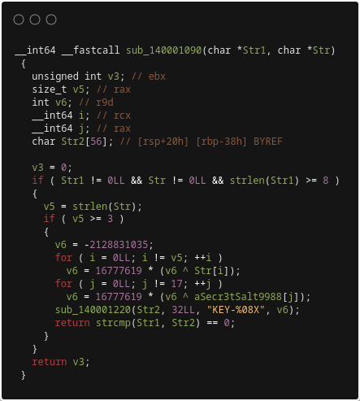
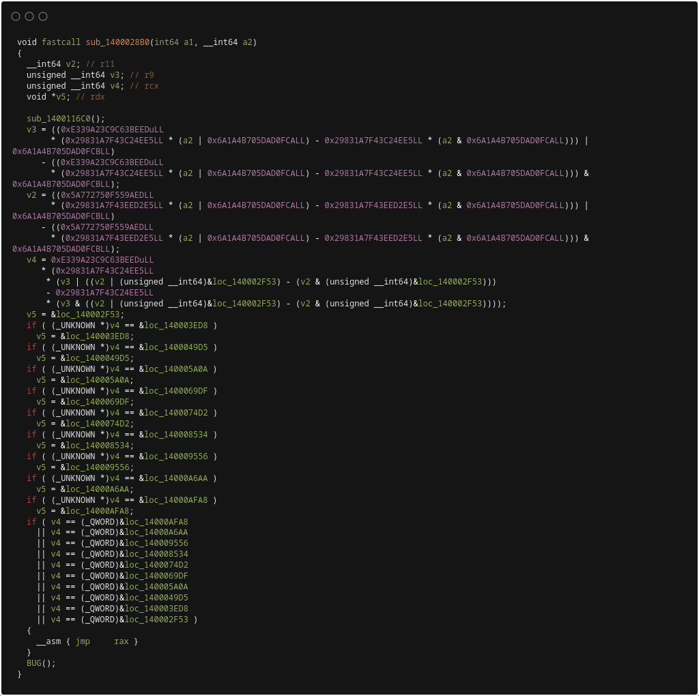
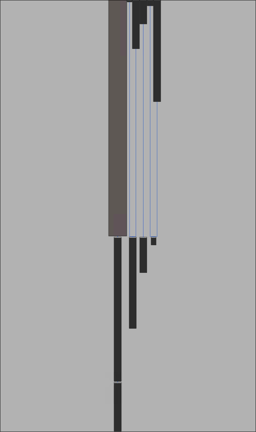
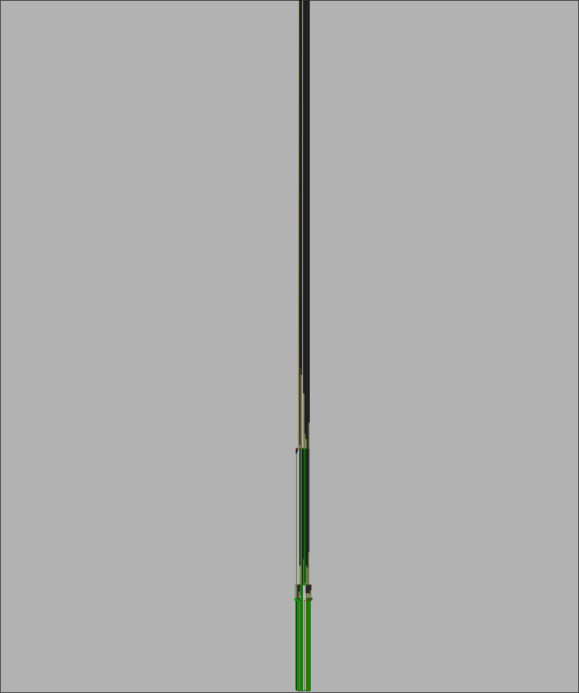

# Visual examples

[Documentation](README.md) / Visual examples

These existing images show decompiler output and control-flow views.
They illustrate code shape, not measured recovery resistance.
The image files do not identify the build revision, seed, or effective configuration.
Do not treat them as a reproducible comparison of the current release.

## Decompiler views

The baseline image contains a string comparison and a short arithmetic loop.
The obfuscated image contains expanded arithmetic and an indirect jump.
The images show different displayed function signatures.
They do not establish that both views represent the same source function.

| Baseline view | Obfuscated view |
|:---:|:---:|
|  |  |

## Control-flow views

These overview images show different graph layouts.
Their scale hides instruction details.
They do not prove matching runtime behavior or that a function passed the [VM build checks](protection.md#vm-lowering-and-build-checks).

| Baseline view | Obfuscated view |
|:---:|:---:|
|  |  |

## Reproducible evaluation

Use the [benchmark workflow](development.md#benchmarks) for baseline and protected artifacts from the same source.
Record the revision, toolchain, configuration, and seed before a comparison.
Compare program behavior separately from static reverse-engineering measurements.
See the [security contract](../SECURITY.md) for the protection boundaries.
